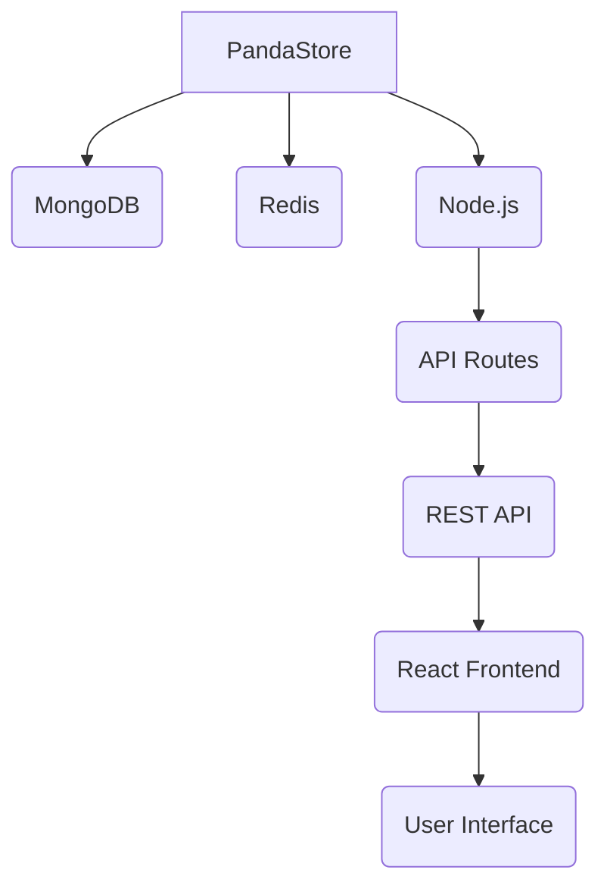

# PandaStore

[](https://opensource.org/licenses/MIT)
[](https://travis-ci.com/example/panda-store)
[](https://coveralls.io/github/example/panda-store?branch=master)

## Description

PandaStore is an open-source e-commerce platform built with modern web technologies. It provides a complete solution for businesses to manage products, orders, customers, and inventory in a user-friendly interface.

## What Problem Does PandaStore Solve?

PandaStore addresses the need for small to medium-sized businesses to have a powerful, yet easy-to-use e-commerce solution without the complexity and cost of enterprise-level platforms. It offers:

- A streamlined approach to online store management
- Customizable product catalog and inventory system
- Secure payment processing integration
- Mobile-responsive design for all devices
- Comprehensive analytics dashboard

## Features

- **Product Management**: Organize products with categories, tags, and attributes
- **Inventory Tracking**: Real-time stock management with low stock alerts
- **Order Processing**: Complete order lifecycle management from creation to fulfillment
- **Customer Relationship Management**: Customer profiles, purchase history, and contact management
- **Multi-channel Integration**: Connect with marketplaces and social media platforms
- **Analytics Dashboard**: Visualize sales trends, customer behavior, and inventory metrics
- **Customizable Themes**: Choose from multiple professional templates or create your own
- **Mobile Responsive**: Works seamlessly across all device sizes

## Requirements

### Prerequisites

Before installing PandaStore, ensure you have:

- Node.js v14.x or newer
- npm v6.x or newer
- MongoDB database (version 4.4 or newer)
- Redis (for caching)
- Web browser (Chrome recommended)

### System Requirements

- Minimum 2 vCPU and 4GB RAM for development environment
- Recommended 4 vCPU and 8GB RAM for production environment

## Installation

### Step 1: Clone the Repository

```bash
git clone https://github.com/yourusername/panda-store.git
cd panda-store
```

### Step 2: Install Dependencies

```bash
npm install
```

### Step 3: Set Up Environment Variables

Create a `.env` file in the root directory with the following:

```env
MONGODB_URI='mongodb://localhost:27017/panda-store'
PORT=3000
SESSION_SECRET='your-secret-key-here'
PAYMENT_Gateway='stripe' # or 'paypal'
```

### Step 4: Run Database Migrations

```bash
npm run migrate
```

### Step 5: Start the Application

```bash
npm start
```

## Configuration

PandaStore uses environment variables for configuration. The main configuration options are:

- `MONGODB_URI`: MongoDB connection string
- `PORT`: Server port number
- `SESSION_SECRET`: Secret key for session management
- `PAYMENT_GATEWAY`: Payment processor (stripe/paypal)
- `STRIPE_PUBLISHABLE_KEY`: Stripe publishable key (if using Stripe)
- `STRIPE_SECRET_KEY`: Stripe secret key (if using Stripe)

## Usage Examples

### Creating a Product

```javascript
const product = {
  name: 'Panda T-Shirt',
  price: 29.99,
  category: 'Clothing',
  description: 'High-quality panda-themed t-shirt',
  stock: 50,
  tags: ['panda', 't-shirt', 'clothing']
};

// Create product via API endpoint /api/products
```

### Managing Orders

```javascript
// Get all orders from last month
const orders = await Order.find({ createdAt: { $gte: startDate, $lte: endDate } });

// Update order status to 'shipped'
await Order.findByIdAndUpdate(orderId, { status: 'shipped' });
```

## Architecture Overview



## API Reference

### Authentication

**POST /api/auth/login**

```json
{
  "email": "user@example.com",
  "password": "password"
}
```

### Products

**GET /api/products**

```json
[
  {
    "id": "prod_123",
    "name": "Panda T-Shirt",
    "price": 29.99,
    "category": "Clothing",
    "stock": 50,
    "createdAt": "2023-01-01T00:00:00Z"
  }
]
```

## Contribution Guide

We welcome contributions from the community! Please follow these guidelines:

1. Fork the repository on GitHub
2. Create a new branch for your feature or bug fix (`git checkout -b feature/your-feature`)
3. Make your changes and test them thoroughly
4. Submit a pull request with a detailed description of your changes

## Testing

PandaStore uses Jest for unit testing and Supertest for API testing.

To run tests:

```bash
npm test
```

### Test Coverage

```bash
npm run coverage
```

## Deployment

### Docker Deployment

```bash
docker-compose up -d --build
```

### Production Build

```bash
npm run build:prod
```

Then deploy using your preferred method (Heroku, AWS, etc.)

## Troubleshooting

### Common Issues

1. **MongoDB Connection Error**
   - Ensure MongoDB is running locally or update `MONGODB_URI`
   - Check network connectivity if using remote MongoDB instance

2. **Payment Processing Failure**
   - Verify payment gateway credentials in `.env`
   - Check if test mode is enabled for development

3. **Build Errors**
   - Ensure all dependencies are installed with `npm install`
   - Clear npm cache with `npm cache clean --force`

## FAQ

**Q: Can I use PandaStore for high-volume production?**
A: Yes, PandaStore is designed to scale with your business needs.

**Q: How often is the code updated?**
A: We release new versions every two weeks with regular bug fixes.

**Q: Is there documentation available?**
A: Yes, comprehensive documentation is available at [docs.panda-store.com](https://docs.panda-store.com)

## License

PandaStore is licensed under the MIT License.

```
Copyright (c) 2023 PandaStore Team

Permission is hereby granted, free of charge, to any person obtaining a copy of this software and associated documentation files (the "Software"), to deal in the Software without restriction, including without limitation the rights to use, copy, modify, merge, publish, distribute, sublicense, and/or sell copies of the Software, and to permit persons to whom the Software is furnished to do so, subject to the following conditions:

The above copyright notice and this permission notice shall be included in all copies or substantial portions of the Software.

THE SOFTWARE IS PROVIDED "AS IS", WITHOUT WARRANTY OF ANY KIND, EXPRESS OR IMPLIED, INCLUDING BUT NOT LIMITED TO THE WARRANTIES OF MERCHANTABILITY, FITNESS FOR A PARTICULAR PURPOSE AND NONINFRINGEMENT. IN NO EVENT SHALL THE AUTHORS OR COPYRIGHT HOLDERS BE LIABLE FOR ANY CLAIM, DAMAGES OR OTHER LIABILITY, WHETHER IN AN ACTION OF CONTRACT, TORT OR OTHERWISE, ARISING FROM, OUT OF OR IN CONNECTION WITH THE SOFTWARE OR THE USE OR OTHER DEALINGS IN THE SOFTWARE.
```

## Contact

For questions or support:

- Email: support@panda-store.com
- GitHub Issues: [https://github.com/yourusername/panda-store/issues](https://github.com/yourusername/panda-store/issues)
- Twitter: [@PandaStore](https://twitter.com/PandaStore)

---

Thank you for choosing PandaStore! We're committed to providing a powerful yet accessible e-commerce solution for businesses of all sizes.