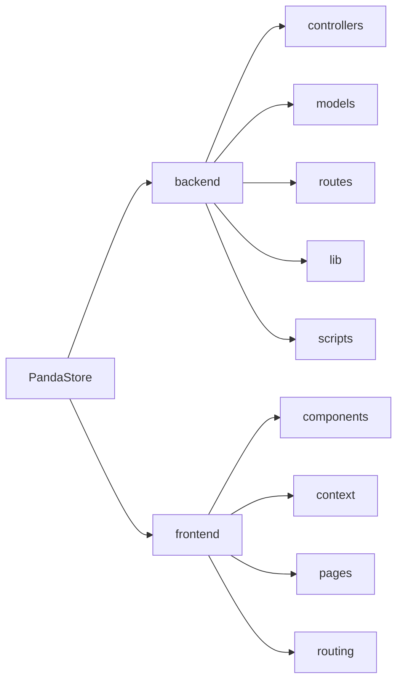
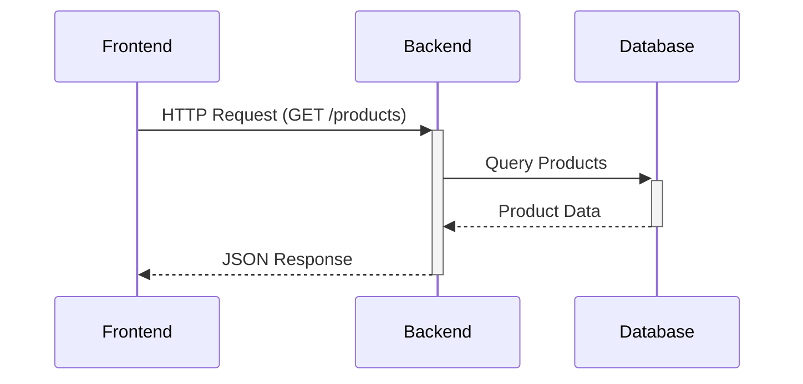

# PandaStore - Full-Stack E-Commerce Platform

## 1. Title and Description

**PandaStore** is a comprehensive open-source e-commerce solution providing complete store management capabilities for modern online businesses. This production-ready platform enables organizations to manage products, categories, suppliers, promotions, and customer interactions through an intuitive administrator dashboard coupled with a customer-facing storefront.

The system addresses critical challenges in digital commerce by providing:
- Centralized inventory and supplier management
- Multi-level product categorization
- Time-sensitive promotional campaigns
- Secure customer authentication
- Responsive shopping interfaces

Target audiences include:
- Developers seeking a MERN stack reference implementation
- Retail businesses requiring turnkey e-commerce solutions
- Entrepreneurs launching digital storefronts
- Educational institutions teaching full-stack development

Key value propositions include:
1. **Complete Operational Management**: Unified control panel for inventory, suppliers, and marketing
2. **Scalable Architecture**: Modular MERN stack design supporting business growth
3. **Cloud-Native Infrastructure**: Integrated media management via Cloudinary
4. **Modern UX Patterns**: Responsive React interface with dashboard analytics
5. **Secure Transactions**: JWT authentication and role-based access control

## 2. Key Features

### 2.1 Core Commerce Capabilities
- **Hierarchical Product Categorization**:  
  Multi-level nested category system with unlimited subcategories and product associations. Supports drag-and-drop organization and visual tree representation.

- **Supplier Relationship Management**:  
  Complete vendor profiles with contact information, product associations, and performance metrics. Includes supplier status tracking and communication logs.

```mermaid
erDiagram
    SUPPLIER ||--o{ PRODUCT : supplies
    SUPPLIER {
        string name
        string status
        string contact.tel
        string contact.email
        string contact.respo
        string contact.adresse
    }
    PRODUCT {
        string name
        string[] images
        number price
        number stock
    }
```

### 2.2 Marketing Automation
- **Promotional Campaign System**:  
  Time-bound promotional posts with multiple content types (new products, special offers, discounts). Features automated activation/deactivation based on schedule.

- **Visual Analytics Dashboard**:  
  Interactive data visualization for sales trends, inventory status, and category distribution using Recharts.

### 2.3 Technical Foundations
- **Secure Authentication**:  
  JWT-based authentication with encrypted password storage (bcrypt), cookie-based session management, and role-based permissions.

- **Cloud Media Management**:  
  Integrated Cloudinary CDN for product image handling with automatic optimization, transformation, and secure delivery.

### 2.4 Administrative Controls
- **Inventory Management**:  
  Real-time stock tracking with low-stock alerts, SKU management, and cost/profit analytics.

- **User Management System**:  
  Complete CRUD operations for user accounts with password reset functionality and activity monitoring.

## 3. Technology Stack

### 3.1 Backend Infrastructure
| Component       | Technology       | Rationale                                                                 |
|-----------------|------------------|---------------------------------------------------------------------------|
| Runtime         | Node.js 18+      | Asynchronous I/O for high concurrency                                     |
| Framework       | Express 4.x      | Minimalist web framework for API development                              |
| Database        | MongoDB 6.x      | Flexible document model for evolving product schemas                      |
| ODM             | Mongoose 8.x     | Schema validation and relationship management                             |
| Authentication  | JSON Web Tokens  | Stateless session management with 3-day expiration                        |
| Image Processing| Cloudinary SDK   | Cloud-based media transformations and CDN delivery                        |
| Security        | Bcrypt 5.x       | Industry-standard password hashing (10 rounds)                            |

### 3.2 Frontend Implementation
| Component       | Technology       | Purpose                                                                   |
|-----------------|------------------|---------------------------------------------------------------------------|
| Core Framework  | React 18.x       | Component-based UI architecture                                           |
| Build Tool      | Vite 4.x         | Rapid development environment with Hot Module Replacement                 |
| Styling         | Tailwind CSS     | Utility-first CSS framework with dark mode support                        |
| State Management| Context API      | Global state sharing across components                                    |
| Charts          | Recharts         | Interactive data visualization components                                 |
| UI Library      | Shadcn/ui        | Accessible, customizable UI components                                    |
| Routing         | React Router 7.x | Client-side navigation with protected routes                              |

### 3.3 Architectural Decisions
- **RESTful API Design**: Resource-oriented endpoints following OpenAPI specifications
- **Modular Code Structure**: Separation of concerns through MVC pattern
- **Containerized Deployment**: Docker compatibility for cloud deployment
- **Optimized Asset Delivery**: Lazy-loaded components and code splitting

## 4. Installation Instructions

### 4.1 System Requirements
- Node.js v18+
- MongoDB 6.0+
- Cloudinary account
- Git 2.20+
- RAM: 4GB minimum (8GB recommended)

### 4.2 Local Development Setup
```bash
# Clone repository
git clone https://github.com/abdessamad10bouih/PandaStore.git
cd PandaStore

# Backend setup
cd backend
npm install
cp .env.example .env  # Update values in .env

# Frontend setup
cd ../frontend
npm install
cp .env.example .env

# Start both servers (in separate terminals)
# Backend terminal:
cd ../backend && npm run dev

# Frontend terminal:
cd ../frontend && npm run dev
```

### 4.3 Environment Configuration
**backend/.env** requirements:
```env
MONGO_URL=mongodb://localhost:27017/pandastore
JWT_SECRET=your_secure_secret_here
PORT=1000
CLOUDINARY_CLOUD_NAME=your_cloud_name
CLOUDINARY_API_KEY=your_api_key
CLOUDINARY_API_SECRET=your_api_secret
FRONTEND_URL=http://localhost:5173
```

### 4.4 Common Issues
**Connection Refused Errors**
```bash
# Verify MongoDB service status
sudo systemctl status mongod

# Check firewall rules
sudo ufw allow 27017
```

**Cloudinary Upload Failures**
- Validate Cloudinary credentials in dashboard
- Ensure file size <5MB (modify multerConfig.js if needed)
- Confirm CORS settings in Cloudinary console

## 5. Usage Examples

### 5.1 API Endpoints
**User Registration**
```http
POST /api/v1/auth/register
Content-Type: application/json

{
  "nom": "John Doe",
  "email": "john@example.com",
  "password": "SecurePassword123",
  "confirmPassword": "SecurePassword123"
}
```

**Product Creation**
```http
POST /api/v1/products
Authorization: Bearer <JWT_TOKEN>
Content-Type: multipart/form-data

Form Data:
- nom: "Organic Cotton T-Shirt"
- description: "Sustainable apparel"
- prix: 29.99
- stock: 100
- categories: ["65432a1b..."]
- image: (file upload)
```

### 5.2 Frontend Navigation
| Route              | Component          | Purpose                            |
|--------------------|--------------------|------------------------------------|
| /dashboard         | DashboardLayout    | Administrative overview            |
| /products          | ProductGrid        | Product inventory management       |
| /categories        | CategoryTree       | Hierarchical category editor       |
| /fournisseurs      | SupplierTable      | Vendor relationship management     |
| /posts             | CampaignList       | Promotional content management     |

## 6. Project Folder Structure


**Key Directories**
- `backend/models`: Mongoose schema definitions (Product, User, Category)
- `backend/controllers`: Business logic handlers (auth, products)
- `frontend/components`: Reusable React components
- `frontend/context`: Global state providers (authentication, products)

## 7. Configuration and Environment Variables

### 7.1 Essential Variables
| Variable                 | Required | Default   | Description                                  |
|--------------------------|----------|-----------|----------------------------------------------|
| MONGO_URL                | Yes      | -         | MongoDB connection string                    |
| JWT_SECRET               | Yes      | -         | 256-bit secret for token signing             |
| CLOUDINARY_CLOUD_NAME    | Yes      | -         | Cloudinary account identifier                |
| CLOUDINARY_API_KEY       | Yes      | -         | Cloudinary API credentials                   |
| CLOUDINARY_API_SECRET    | Yes      | -         | Cloudinary API credentials                   |
| FRONTEND_URL             | Yes      | -         | Origin for CORS configuration                |

### 7.2 Optional Parameters
| Variable                 | Default | Purpose                                   |
|--------------------------|---------|-------------------------------------------|
| PORT                     | 1000    | Backend service port                      |
| NODE_ENV                 | development | Runtime environment detection          |
| SESSION_EXPIRATION       | 3d      | JWT token lifetime                        |

## 8. Testing and CI/CD

### 8.1 Test Execution
No test suite currently implemented. Recommended workflow:

```bash
# Install test runner
npm install -D jest supertest @testing-library/react

# Example test command (to be implemented)
npm test
```

### 8.2 Continuous Integration
Suggested GitHub Actions configuration (.github/workflows/ci.yml):
```yaml
name: CI Pipeline
on: [push, pull_request]

jobs:
  build:
    runs-on: ubuntu-latest
    steps:
    - uses: actions/checkout@v3
    - name: Setup Node
      uses: actions/setup-node@v3
      with:
        node-version: 18
    - run: npm ci
    - run: npm run build
```

## 9. Deployment Instructions

### 9.1 Production Build
```bash
# Build frontend assets
cd frontend
npm run build

# Start production server
cd ../backend
NODE_ENV=production node index.js
```

### 9.2 Platform-Specific Guides
**Render.com Deployment**
1. Create new Web Service
2. Connect GitHub repository
3. Configure build command: `cd frontend && npm run build`
4. Set start command: `cd backend && node index.js`
5. Inject environment variables via dashboard

**Heroku Deployment**
```bash
heroku create
heroku addons:create mongolab
heroku config:set JWT_SECRET=your_secret
git push heroku main
```

## 10. Contribution Guidelines

### 10.1 Development Workflow
1. Fork repository
2. Create feature branch: `git checkout -b feature/new-payment-integration`
3. Commit changes with semantic messages:
   - `feat: Add PayPal payment processor`
   - `fix: Resolve inventory sync bug`
4. Push to fork: `git push origin feature/new-payment-integration`
5. Open pull request against `main` branch

### 10.2 Code Standards
- **JavaScript**: ES2022 syntax, async/await preferred over callbacks
- **React**: Functional components with hooks
- **Styling**: Tailwind CSS utility classes (custom colors in tailwind.config.js)
- **Documentation**: JSDoc for all functions, PropTypes for components

### 10.3 Issue Reporting
1. Verify issue doesn't exist in open tickets
2. Provide reproduction steps with code samples
3. Include environment details (OS, Node version, browser)
4. Attach relevant logs/error messages

## 11. License and Credits

### 11.1 Licensing
This project is licensed under the **MIT License**:

```
Permission is hereby granted, free of charge, to any person obtaining a copy
of this software and associated documentation files (the "Software"), to deal
in the Software without restriction, including without limitation the rights
to use, copy, modify, merge, publish, distribute, sublicense, and/or sell
copies of the Software...
```

### 11.2 Third-Party Assets
| Dependency           | License      | Purpose                          |
|----------------------|--------------|----------------------------------|
| Mongoose             | MIT          | MongoDB Object Modeling          |
| React                | MIT          | UI Component Library             |
| Cloudinary SDK       | MIT          | Cloud Media Management           |
| Tailwind CSS         | MIT          | CSS Framework                    |
| Recharts             | MIT          | Data Visualization               |

## 12. Maintainers and Contacts

**Core Maintainer**:  
[Abdessamad Bouih](https://github.com/abdessamad10bouih)

**Support Channels**:
- GitHub Issues: Bug reports and feature requests
- Documentation: Project Wiki
- Community Forum: Discord Server (Coming Soon)

## 13. Repository Analysis

### 13.1 Architectural Patterns
- **MVC Implementation**:  
  Clear separation between Models (Mongoose schemas), Controllers (business logic), and Routes (API endpoints)

- **Layered Architecture**:  
  Distinct presentation (React), application (Express), and data layers (MongoDB)



### 13.2 Code Quality Assessment
**Strengths**
- Consistent ES module syntax (import/export)
- Proper error handling middleware
- Meaningful HTTP status codes
- Secure password handling (bcrypt + salt)

**Improvement Opportunities**
1. Add API documentation (Swagger/OpenAPI)
2. Implement comprehensive test suite
3. Introduce Redis caching layer
4. Enhance input validation schemas
5. Add rate limiting for auth endpoints

### 13.3 Performance Considerations
- Implement pagination for large datasets
- Add indexing for MongoDB query optimization
- Introduce frontend caching strategies
- Enable gzip compression for API responses

### 13.4 Scalability Recommendations
1. Containerize with Docker
2. Implement horizontal scaling with Redis sessions
3. Add message queue for async operations
4. Introduce API versioning strategy
5. Implement CI/CD pipeline with automated testing