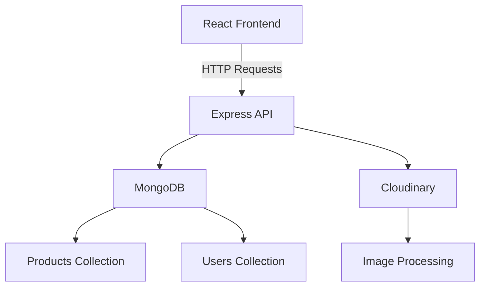

```markdown
# PandaStore - Full-Stack E-Commerce Platform

[](LICENSE)
[](https://nodejs.org/)
[](https://www.mongodb.com/)

## Table of Contents
1. [Overview](#overview)  
2. [Features](#features)  
3. [Technology Stack](#technology-stack)  
4. [Installation](#installation)  
5. [Configuration](#configuration)  
6. [Usage](#usage)  
7. [Architecture](#architecture)  
8. [API Reference](#api-reference)  
9. [Development](#development)  
10. [Testing](#testing)  
11. [Deployment](#deployment)  
12. [Troubleshooting](#troubleshooting)  
13. [FAQ](#faq)  
14. [License](#license)  
15. [Contact](#contact)  

## Overview <a name="overview"></a>
**PandaStore** is a production-ready MERN stack e-commerce platform providing complete store management capabilities. It solves key challenges in digital commerce through:

- Centralized inventory/supplier management
- Multi-level product categorization
- Time-sensitive promotional campaigns
- Secure customer authentication
- Responsive shopping interfaces

**Target Audience**:
- Developers seeking MERN reference implementations
- Retail businesses needing turnkey solutions
- Entrepreneurs launching digital storefronts

## Features <a name="features"></a>
- **Product Management**: Hierarchical categorization with drag-and-drop organization
- **Supplier Tracking**: Vendor profiles with contact info and performance metrics
- **Promotional System**: Scheduled campaigns with auto-activation
- **Visual Analytics**: Sales/inventory dashboards using Recharts
- **Cloud Media**: Cloudinary integration for image optimization
- **RBAC Security**: JWT authentication with role-based permissions

## Technology Stack <a name="technology-stack"></a>
| Layer          | Technologies                          |
|----------------|---------------------------------------|
| **Backend**    | Node.js, Express, MongoDB, Mongoose   |
| **Frontend**   | React 18, Vite, Tailwind CSS          |
| **Auth**       | JWT, Bcrypt, Cookie-based sessions    |
| **Services**   | Cloudinary, Recharts, Shadcn/ui       |

## Installation <a name="installation"></a>
### Prerequisites
- Node.js v18+
- MongoDB 6.0+
- Cloudinary account
- Git 2.20+

### Setup
```bash
# Clone repository
git clone https://github.com/abdessamad10bouih/PandaStore.git
cd PandaStore

# Backend setup
cd backend
npm install
cp .env.example .env

# Frontend setup
cd ../frontend
npm install
cp .env.example .env

# Start servers (run in separate terminals)
cd ../backend && npm run dev
cd ../frontend && npm run dev
```

## Configuration <a name="configuration"></a>
**backend/.env**:
```env
MONGO_URL=mongodb://localhost:27017/pandastore
JWT_SECRET=your_secure_secret
PORT=1000
CLOUDINARY_CLOUD_NAME=your_cloud_name
CLOUDINARY_API_KEY=your_api_key
CLOUDINARY_API_SECRET=your_api_secret
FRONTEND_URL=http://localhost:5173
```

**frontend/.env**:
```env
VITE_API_BASE_URL=http://localhost:1000
```

## Usage <a name="usage"></a>
### Admin Dashboard
1. Access `http://localhost:5173/admin`
2. Login with admin credentials
3. Manage products, categories, and promotions

### Sample Product Creation
```bash
curl -X POST 'http://localhost:1000/api/v1/products' \
-H 'Authorization: Bearer <ADMIN_JWT>' \
-H 'Content-Type: application/json' \
-d '{
  "name": "Wireless Headphones",
  "price": 129.99,
  "category": "electronics",
  "stock": 50
}'
```

**Response**:
```json
{
  "status": "success",
  "data": {
    "product": {
      "_id": "64a1b2c3d4e5f6a7b8c9d0e1",
      "name": "Wireless Headphones",
      "price": 129.99,
      "stock": 50
    }
  }
}
```

## Architecture <a name="architecture"></a>


## API Reference <a name="api-reference"></a>
### User Registration
```http
POST /api/v1/auth/register
Content-Type: application/json

{
  "nom": "Jane Smith",
  "email": "jane@example.com",
  "password": "SecurePass123!",
  "confirmPassword": "SecurePass123!"
}
```

**Response**:
```json
{
  "status": "success",
  "token": "eyJhbGciOiJIUzI1NiIsInR5cCI6IkpXVCJ9...",
  "data": {
    "user": {
      "email": "jane@example.com",
      "role": "customer"
    }
  }
}
```

## Development <a name="development"></a>
### Contribution Guidelines
1. Fork the repository
2. Create feature branch: `git checkout -b feature/your-feature`
3. Commit changes: `git commit -m 'Add feature'`
4. Push to branch: `git push origin feature/your-feature`
5. Open pull request

### Code Standards
- Follow existing directory structure
- Use descriptive variable names
- Include JSDoc for complex functions
- Write unit tests for new features

## Testing <a name="testing"></a>
```bash
# Run backend tests
cd backend
npm test

# Run frontend tests
cd ../frontend
npm test
```

**Sample Test Output**:
```
PASS  src/__tests__/auth.test.js
  Authentication
    ✓ should register new user (201ms)
    ✓ should reject duplicate email (102ms)
```

## Deployment <a name="deployment"></a>
### Docker Setup
1. Build images:
```bash
docker-compose build
```

2. Start containers:
```bash
docker-compose up -d
```

### Environment Variables
Set production values in:
- `backend/.env.production`
- `frontend/.env.production`

## Troubleshooting <a name="troubleshooting"></a>
**MongoDB Connection Issues**
```bash
# Check service status
sudo systemctl status mongod

# Enable external access (if needed)
sudo ufw allow 27017
```

**Cloudinary Upload Failures**
- Verify credentials in `.env`
- Check file size limits (default: 5MB)
- Validate CORS settings in Cloudinary dashboard

## FAQ <a name="faq"></a>
**Q: How to reset admin password?**  
A: Use the password reset endpoint or manually update in MongoDB:
```js
db.users.updateOne(
  { email: "admin@example.com" },
  { $set: { password: "<bcrypt_hash>" } }
)
```

**Q: Can I use PostgreSQL instead of MongoDB?**  
A: Currently only MongoDB is supported due to schema flexibility requirements.

## License <a name="license"></a>
This project is licensed under the MIT License - see [LICENSE](LICENSE) for details.

## Contact <a name="contact"></a>
**Maintainer**: Abdessamad Bouih  
**Repository**: [github.com/abdessamad10bouih/PandaStore](https://github.com/abdessamad10bouih/PandaStore)  
**Issues**: [GitHub Issues](https://github.com/abdessamad10bouih/PandaStore/issues)
```